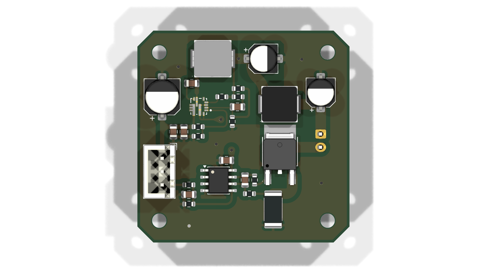
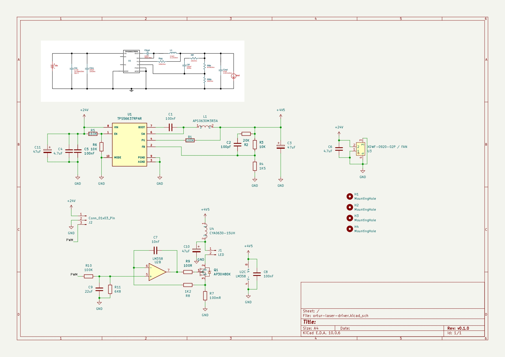

# Ortur Laser Driver PCB

This is a homebrew PCB replacement for the LU2-4 LF laser module driver PCB used by ortur lasers.

## What does it look like.

## The schematic

You can find the schematic PDF and gerbers in the [releases](https://github.com/yarsatech/Ortur-Laser-Driver/releases).

## 
Hope this helps :)

Proudly designed and made in Nepal by Yarsa Tech.
